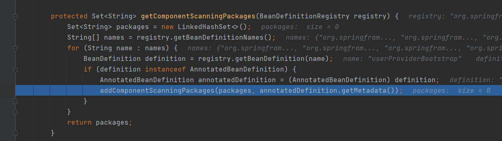
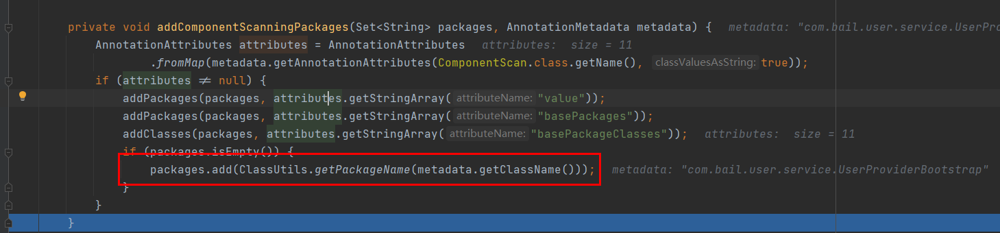

##功能
此工程是为了方便查看dubbo接口注册的过程，而构建的一个项目，
方便查看注册、消费过程中，数据的变化。

###注册过程
####加载过程
1、SpringBoot启动过程，加载dubbo_provider.xml文件
应用上下文对象：AnnotationConfigServletWebServerApplicationContext 注解配置web servlet应用上下文,

SpringApplication的 prepareContext()方法，调用load()方法，其中对启动类进行解析，即UserProviderBootstrap配置类进行主类解析。
调用BeanDefinitionLoader的load()方法，重载调用load(Class<?> source)，调用AnnotatedBeanDefinitionReader，进行配置类注册；
调用AnnotationConfigUtils的processCommonDefinitionAnnotations方法，进行启动类上通用注解解析，
调用BeanDefinitionReaderUtils的registerBeanDefinition()方法进行bean的具体注册，经过多层调用，调用DefaultListableBeanFactory的
registerBeanDefinition()方法进行BeanDefinition在容器的注入，至此 prepareContext()方法执行完毕，
主要完成了启动类BeanDefinition的注入

接着调用SpringApplication的refreshContext(context)方法，调用了AbstractApplicationContext的refresh()方法，进入上下文刷新的主要过程，
obtainFreshBeanFactory()方法调用了GenericApplicationContext的refreshBeanFactory()方法，返回了已经创建的BeanFactory
（此处不同于SpringWeb项目启动，调用的是AbstractRefreshableApplicationContext的refreshBeanFactory()方法）

refresh()方法接着调用postProcessBeanFactory(beanFactory)方法,主要完成了作用域范围依赖的注册，如session；request、response、
application范围域，在springboot项目中，并没有执行下面的功能： 对创建的 Bean 工厂进行后置处理，
如处理 @Configuration 注解的配置类，从该配置类中获取更多的 Java 对象的元数据，
如在该配置类内部使用 @Bean 注解的方法会被加载和对应到一个 Java 对象；

refresh()方法接着调用invokeBeanFactoryPostProcessors(beanFactory)方法，调用了 SharedMetadataReaderFactoryContextInitializer
的postProcessBeanDefinitionRegistry()方法，配置了配置类后置处理器org.springframework.context.annotation.internalConfigurationAnnotationProcessor，
接着调用了ConfigurationWarningsApplicationContextInitializer的postProcessBeanDefinitionRegistry()方法，经过多层调用，调用了
getComponentScanningPackages()方法，解析BeanDefinitionMap中注解类型的BeanDefinition，用来加载配置类中的Bean信息，此处读取到了com.bail.user.service.UserProviderBootstrap
我们的启动类，通过读取注解类中的元信息,添加扫描包路径信息。
接下来，都是在解析UserProviderBootstrap主类的过程：


读取到的元信息有@SpringBootApplication、@ImportResources注解,根据从注解中获取到的属性信息读取package，如果获取package为空，则默认设置为
当前启动类下的包路径及其子路径

在调用完两个内置后处理器之后，加载后置处理器的bean实例，getBean(String name, Class<T> requiredType)，此处的requiredType = BeanDefinitionRegistryPostProcessor，
name = org.springframework.context.annotation.internalConfigurationAnnotationProcessor，创建了ConfigurationClassPostProcessor类的实例，
调用sortPostProcessors(currentRegistryProcessors, beanFactory)对注册处理器进行排序，随后调用invokeBeanDefinitionRegistryPostProcessors方法，即ConfigurationClassPostProcessor bean,
,调用ConfigurationClassPostProcessor的processConfigBeanDefinitions()方法，此处解析到启动类带有@Configuration注解，将主类beanDefinition添加到了候选类中configCandidates中，
随后在ConfigurationClassPostProcessor中创建了ConfigurationClassParser解析类，随后对候选类进行解析，随后调用ConfigurationClassParser类的processConfigurationClass()方法，对
Configuration类进行解析，包括Component、PropertySources、ComponentScan、ComponentScans、ImportResource等注解进行解析。

针对Component注解，调用随后调用ConfigurationClassParser类的processMemberClasses方法，解析内部成员类；针对ComponentScans，ComponentScan注解，调用的是
ComponentScanAnnotationParser类的parse()方法，此处在解析到basePackages属性的时候，如果basePackages为空，默认设置为包根路径，读取到basePackages属性值后，
调用ClassPathBeanDefinitionScanner实例对象scanner的doScan()方法，对包路径进行BeanDefinition的注册，多层调用，调用ClassPathScanningCandidateComponentProvider类的
scanCandidateComponents()方法，根据类路径进行候选类的扫描，首先扫描到了包路径下的所有类，将类包装成Resource类型，然后根据从Resource上获取到的metadataReader信息判断是否是
候选类，很奇怪，此处的启动类居然不符合判断方法，OrderServiceImpl、UserServiceImpl符合候选类，至此从加载类中找到两个标注了@Component注解的候选类。然后对两个候选类进行循环处理，
处理过程中，继续调用postProcessBeanDefinition方法，对BeanDefinition进行默认属性赋值，调用AnnotationConfigUtils.processCommonDefinitionAnnotations进行BeanDefinition通用属性的赋值，如
Lazy、Primary、DependsOn、Role、Descriptiond等属性的赋值；随后有一个作用域范围代理模式的处理，如果不符合直接返回。
接着针对候选项类进行配置类处理，调用了processConfigurationClass()方法，包括Component、PropertySources、ComponentScan、ComponentScans、ImportResource、BeanMethod等注解的解析，
循环对Component类型类进行处理。

接着处理@Import 注解，此处貌似包含对各个@ImportSelector的处理

接着处理 @ImportResource注解，此处对dubbo-provider.xml文件进行解析处理；


此处，将location文件及解析类放到了map中
解析完启动类，此时configurationClasses map中总共有3个类，启动类+Order+User3个配置类
接着，调用一些自动装配类，如属性占位符自动装配类、总共加载了50左右各Configuration类

刷新应用上下文，加载配置资源，AbstractApplicationContext 的refresh()方法

以 com.bail.user.service.IUserService接口为例，
在bean初始化属性设置完之后，触发ServiceBean的 afterProperties方法，在afterProperties方法中，加载了applicatonConfig对象、
registerConfig “<dubbo:registry address="zookeeper://127.0.0.1:2181" protocol="zookeeper" id="com.alibaba.dubbo.config.RegistryConfig" />”，
加载了ProtocolConfig配置，<dubbo:protocol name="dubbo" port="20880" id="dubbo" /> 返回的WrapperBean是一个ServiceBean类型的Bean，包括对外提供的接口、方法、超时、重试等属性。
####注册内容：

当只有一个接口一个方法的时候：
```properties
dubbo
    com.bail.user.service.IUserService
        providers
            dubbo://192.168.137.210:20880/com.bail.user.service.IUserService\
  ?anyhost=true&application=user-provider&dubbo=2.6.2\
  &generic=false&interface=com.bail.user.service.IUserService\
  &methods=queryList&pid=23128&revision=1.0.0\
  &side=provider&timestamp=1636619128385&version=1.0.0
```
当一个接口多个方法的时候 "&methods=getUserById,queryList"
```properties
dubbo
    com.bail.user.service.IUserService
        providers
            dubbo://192.168.137.210:20880/com.bail.user.service.IUserService\
  ?anyhost=true&application=user-provider&dubbo=2.6.2\
  &generic=false&interface=com.bail.user.service.IUserService\
  &methods=getUserById,queryList&pid=35280&revision=1.0.0\
  &side=provider&timestamp=1636622016888&version=1.0.0
```
当一个接口中有多个方法，某个方法有特殊配置的时候，针对方法会有getUserById.timeout=3000、getUserById.retries
拼接字符串生成，针对接口的只有单一属性字符串：retries=2
```properties
dubbo
    com.bail.user.service.IUserService
        providers
            dubbo://192.168.137.210:20880/com.bail.user.service.IUserService\
  ?anyhost=true&application=user-provider&dubbo=2.6.2\
  &generic=false&getUserById.retries=3&getUserById.timeout=3000\
  &interface=com.bail.user.service.IUserService\
  &methods=getUserById,queryList&pid=27776\
  &retries=2&revision=1.0.0&side=provider&timeout=8000\
  &timestamp=1636622208261&version=1.0.0
```
当有多个接口时，内容如下
```properties
dubbo
    com.bail.user.service.IUserService
    com.bail.user.service.IOrderService
        providers
            dubbo://...
        consumers
            consumer://...
```
### 消费过程
消费内容：
```properties
dubbo
    com.bail.user.service.IUserService
        consumers
            consumer://192.168.137.210/com.bail.user.service.IUserService?application=user-consumer&category=consumers&check=false&dubbo=2.6.2&interface=com.bail.user.service.IUserService&methods=getUserById,queryList&pid=39836&revision=1.0.0&side=consumer&timestamp=1636623061459&version=1.0.0
```